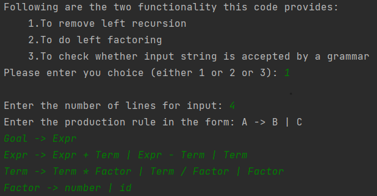
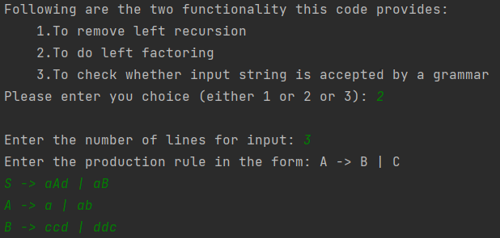
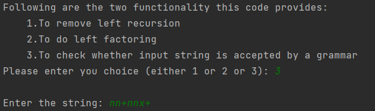

# Compiler Design Lab

---

## Syntax Analysis/Parsing
## Following are my details for assignment submission:
<p>Name: &nbsp;&nbsp;&nbsp;&nbsp;Ayush Vinayak Asutkar</p>
<p>Roll No.: &nbsp;20CS01057</p>
<p>Semester: &nbsp;7th</p>
<p>Year of study: &nbsp;4th year</p>
<p>Subject: &nbsp;&nbsp;Compiler Design Laboratory</p>
<p>Assignment: &nbsp;Assignment - 4</p>

---

## How to run
1. Clone the repository: https://github.com/Ayush-Asutkar/Left-Recursion-and-Left-Factoring.git
2. Open in your favourite editor. (The editor used while making this project was Intellij IDEA)
3. Run the complete project by running the Main.java in src folder. Follow the prompt to give input.

## Problem Statement
### Question 1
<p>Write a program to remove left-recursion from grammar G given as input.</p>
<p>Following is the input prompt:</p>
<p></p>
<p>Following is the output:</p>

<details>
<summary>Output:</summary>

```
Input rules:
Following are the rules in the given grammar:
ProductionRule: Goal -> [Expr]
ProductionRule: Expr -> [Expr+Term, Expr-Term, Term]
ProductionRule: Term -> [Term*Factor, Factor, Term/Factor]
ProductionRule: Factor -> [number, id]

After removal of left recursion:
Following are the rules in the given grammar:
ProductionRule: Goal -> [Expr]
ProductionRule: Expr -> [TermExpr']
ProductionRule: Term -> [FactorTerm']
ProductionRule: Factor -> [number, id]
ProductionRule: Expr' -> [ε, -TermExpr', +TermExpr']
ProductionRule: Term' -> [ε, /FactorTerm', *FactorTerm']
```

</details>

### Question 2
<p>Write a program that takes a grammar as input and produces an equivalent left-factored grammar as output</p>
<p>Following is the input prompt:</p>
<p></p>
<p>Following is the output:</p>

<details>
<summary>Output:</summary>

```
Input rules:
Following are the rules in the given grammar:
ProductionRule: S -> [aB, aAd]
ProductionRule: A -> [a, ab]
ProductionRule: B -> [ddc, ccd]

After doing left factoring:
Following are the rules in the given grammar:
ProductionRule: S -> [aS']
ProductionRule: A -> [aA']
ProductionRule: B -> [ddc, ccd]
ProductionRule: S' -> [B, Ad]
ProductionRule: A' -> [b, ε]
```

</details>

### Question 3
<p>Implement a recursive descent parser for the following grammar with non-terminals {S, B, A}, 
start symbol S, terminal symbols {n, +, x}:</p>
<p>S -> n B</p>
<p>B -> n B A B | ε</p>
<p>A -> + | x</p>

<p>Given any string of terminal symbols, the parser should answer whether it is 
accepted or not accepted. Display the execution of the parser for the given input.
(Rule applied, current sentential form, and the remaining input).</p>
<p>Following is the input prompt:</p>
<p></p>
<p>Following is the output:</p>

<details>
<summary>Output:</summary>

```
Current sentential form: S
Remaining input: nn+nnx+
Rule applying: S -> n B

Current sentential form: nB
Remaining input: nn+nnx+
Rule applying: Parsing Terminal: n

Current sentential form: nB
Remaining input: n+nnx+
Rule applying: B -> n B A B

Current sentential form: nnBAB
Remaining input: n+nnx+
Rule applying: Parsing Terminal: n

Current sentential form: nnBAB
Remaining input: +nnx+
Rule applying: B -> n B A B

Current sentential form: nnnBABAB
Remaining input: +nnx+
Rule applying: Parsing Terminal: n

Could not parse terminal: n

Current sentential form: nnnBABAB
Remaining input: +nnx+
Rule applying: B -> ε

Current sentential form: nnεAB
Remaining input: +nnx+
Rule applying: A -> +

Current sentential form: nnε+B
Remaining input: +nnx+
Rule applying: Parsing Terminal: +

Current sentential form: nnε+B
Remaining input: nnx+
Rule applying: B -> n B A B

Current sentential form: nnε+nBAB
Remaining input: nnx+
Rule applying: Parsing Terminal: n

Current sentential form: nnε+nBAB
Remaining input: nx+
Rule applying: B -> n B A B

Current sentential form: nnε+nnBABAB
Remaining input: nx+
Rule applying: Parsing Terminal: n

Current sentential form: nnε+nnBABAB
Remaining input: x+
Rule applying: B -> n B A B

Current sentential form: nnε+nnnBABABAB
Remaining input: x+
Rule applying: Parsing Terminal: n

Could not parse terminal: n

Current sentential form: nnε+nnnBABABAB
Remaining input: x+
Rule applying: B -> ε

Current sentential form: nnε+nnεABAB
Remaining input: x+
Rule applying: A -> +

Current sentential form: nnε+nnε+BAB
Remaining input: x+
Rule applying: Parsing Terminal: +

Could not parse terminal: +

Current sentential form: nnεAnnε+BAB
Remaining input: x+
Rule applying: A -> x

Current sentential form: nnεxnnε+BAB
Remaining input: x+
Rule applying: Parsing Terminal: x

Current sentential form: nnεxnnε+BAB
Remaining input: +
Rule applying: B -> n B A B

Current sentential form: nnεxnnε+nBABAB
Remaining input: +
Rule applying: Parsing Terminal: n

Could not parse terminal: n

Current sentential form: nnεxnnε+nBABAB
Remaining input: +
Rule applying: B -> ε

Current sentential form: nnεxnnε+εAB
Remaining input: +
Rule applying: A -> +

Current sentential form: nnεxnnε+ε+B
Remaining input: +
Rule applying: Parsing Terminal: +

Current sentential form: nnεxnnε+ε+B
Remaining input: 
Rule applying: B -> n B A B

Current sentential form: nnεxnnε+ε+nBAB
Remaining input: 
Rule applying: B -> ε

Final sentential form: nnεxnnε+ε+ε
The input string nn+nnx+ is accepted
```

</details>

<p>For more details check the pdf: <a href="Question.pdf">"Question.pdf"</a></p>
